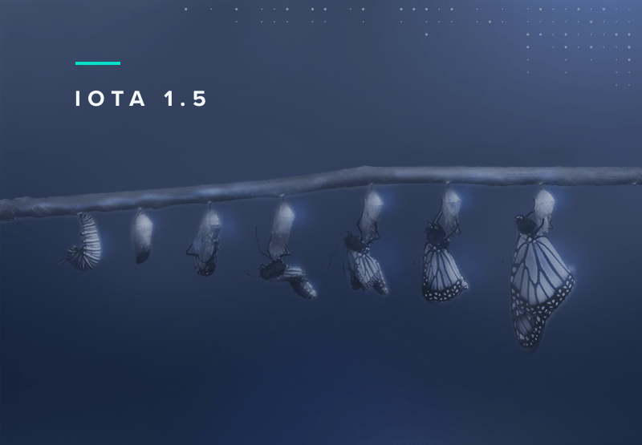

# What is Chrysalis

The objective of the IOTA Foundation is to optimize the IOTA mainnet before Coordicide and to offer an enterprise-ready solution for our ecosystem. `Chrysalis` acts as an intermediate update in the progress towards Coordicide. This article outlines what the Chrysalis upgrade entails.  

A chrysalis is “the form a caterpillar takes before it emerges from its cocoon as a fully-formed moth or butterfly”. In the context of IOTA, Chrysalis is the mainnet’s intermediate stage before Coordicide is complete. The main purpose of Chrysalis is to improve the usability of the current IOTA mainnet, for users and developers alike.

Why is this process of adopting major protocol improvements relatively unique to IOTA among permissionless DLTs? The simple answer is the absence of miners. In most permissionless DLTs, the miners’ economic incentives differ from those of regular network users. Changes to throughput and network latencies can disrupt the fee market the miners rely on. This makes them likely to object to network upgrades as it affects their bottom line.

In IOTA, validators and users are one and the same. There is no conflict of interests between parties with different motivations, meaning there is a much smoother path to network improvements. This allows for incremental and smooth pgrades to the network before Coordicide.

What are the specific Chrysalis upgrades?

## White-flag Approach

[The White-flag approach](https://iota.cafe/t/conflict-white-flag-mitigate-conflict-spamming-by-ignoring-conflicts/233) which is used for calculating balances. It is a simpler, conflict-ignoring approach that improves the speed and efficiency of tip selection, eliminates many network attacks, and significantly reduces the need for reattachments.

## New Milestone Selection Algorithm

[A new milestone selection algorithm for the coordinator](https://iota.cafe/t/coordinator-improvements/310), that focuses on allowing the network to support much more confirmed transactions per second (CTPS) than before with higher computational efficiency.

## URTS Tip Selection

A new [Uniform random tip selection](https://github.com/iotaledger/protocol-rfcs/blob/master/text/0008-uniform-random-tip-selection/0008-uniform-random-tip-selection.md) in node software. It is significantly faster and more efficient than the previous tip selection algorithm.

## Ed25519 Signature Scheme

[The Ed25519 signature scheme](https://github.com/iotaledger/protocol-rfcs/blob/ee07797acb5940b7dbb5c3411b184ccdc6afdbb1/text/0000-ed25519-signature-scheme/0000-ed25519-signature-scheme.md) has been added to the network, replacing the current Winternitz one time signature scheme (W-OTS) signature scheme. Using an EdDSA signature scheme allows the protocol and clients using the protocol to run more efficiently on established hardware. Unlike W-OTS, the scheme also allows for the re-use of private keys, which introduces reusable addresses to the protocol. This change also dramatically reduces the transaction size, saving network bandwidth and processing time.

## Atomic Transactions

[Atomic transactions](https://github.com/luca-moser/protocol-rfcs/blob/signed-tx-payload/text/0000-transaction-payload/0000-transaction-payload.md) that move the protocol from the current, complicated, bundle construct and use simpler atomic transactions instead. This results in much simpler development and more adaptable and maintainable code of the core software. In addition, atomic transactions reduce network overhead, reduce transaction validation and signature verification load, and improve spam protection and congestion control.

## Switch to UTXO Model

[A switch to the UTXO model](https://iota.cafe/t/switching-to-utxo-model-for-balances-colored-coins-easier-conflict-resolution/229) from the current account model. Every coin on an address becomes uniquely identifiable and every spend names the exact coins that it wants to move. This allows for faster and more exact conflict handling and improves resilience and security of the protocol. In addition, switching to UTXO makes other functionalities, such as colored tokens, on the protocol possible in the future.

## Internal Binary Representation

[A switch to an internal binary representation of the trinary transaction](https://github.com/luca-moser/protocol-rfcs/blob/signed-tx-payload/text/0000-transaction-payload/0000-transaction-payload.md). This allows us to work on binary data for validation, IO, and other processing without the current reliance on binary-ternary conversions as in the pre-Chrysalis software node software. The switch to binary transactions further reduces the transaction size, saving network bandwidth and processing time.

## New Node API and Client Libraries
With Chrysalis, IOTA offers a more standard API on both the node and client library level. Node implementations provide a completely redesigned [RESTful](https://editor.swagger.io/?url=https://raw.githubusercontent.com/rufsam/protocol-rfcs/master/text/0026-rest-api/rest-api.yaml) and [eventful](https://playground.asyncapi.io/?load=https://raw.githubusercontent.com/luca-moser/protocol-rfcs/rfc/node-event-api/text/0033-node-event-api/0033-node-event-api.yml) API implementations.

Our [client libraries](../libraries/overview.md) provide high-level abstractions that allow developers to build solutions that are easier to develop and cheaper to maintain.
