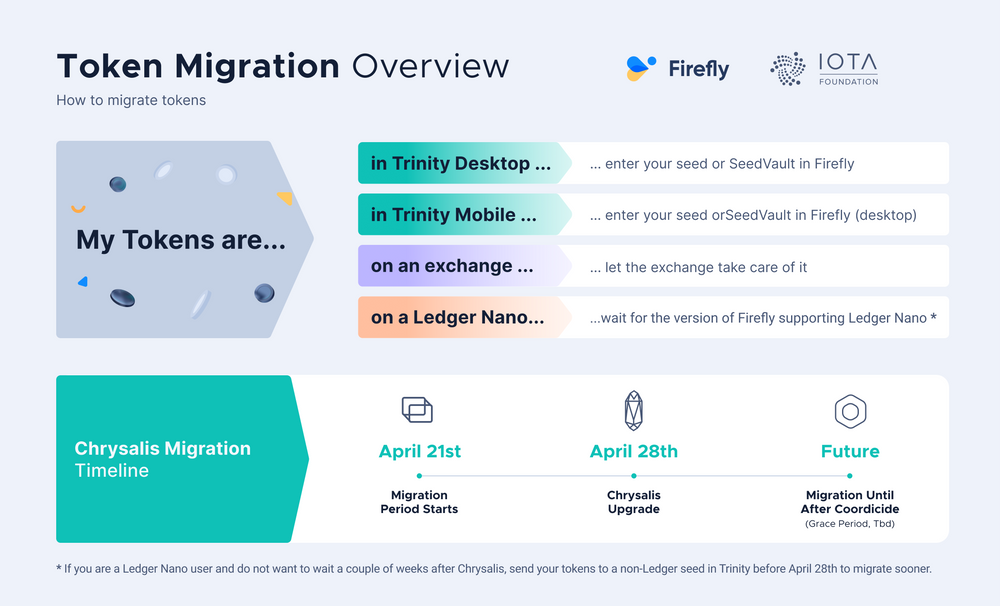

# Migration

For the transition to Chrysalis Phase 2, the IOTA Foundation had to develop a way for funds to be migrated to this new network. The reason a migration mechanism needs to exist in the first place, is because the new network no longer supports WOTS addresses (currently all funds in the legacy network reside on these).

Fore more information how to do the Token Migration, please read [this blog entry](https://blog.iota.org/the-chrysalis-token-migration-starts-now/). 

A programmatic guide about the Token Migration you can find in the Guides Section [Token Migration](../guides/token_guide.md).

This document will describe, how to migration works in detail.

## How the IOTA Chrysalis Phase 2 migration works

The developed mechanism features following properties:

- It should be trustless, meaning that everyone who’s interested can verify that migrated funds are indeed legit and are not produced out of thin air.
- Migrations should not take a long amount of time (<10 minutes) and can be performed at any time for the foreseeable future.

Before going into the actual developed mechanism, lets see why other mechanisms were not chosen:

- Migrating funds by performing periodic global snapshots on both networks: While this approach certainly would have been the easiest to do, it would have blocked funds of people between the times of global snapshots. For example, if we would have taken global snapshots monthly (to carry over funds from burn/migration addresses), token holders would have been excluded from opportunities arising from the change in token price: i.e., perhaps you wanted to sell your tokens but were blocked by the fact that the next global snapshot would only be performed in 20 days and so you couldn’t move your tokens to an exchange (which only supports Chrysalis Phase 2 IOTA).
- Supporting WOTS on Chrysalis Phase 2 (and only allowing to send to non WOTS addresses): While certainly also a viable option, we decided to not include support for WOTS as it brings a number of legacy problems we want to get rid of:
    - WOTS signatures are very large and make up a disproportional amount of data in a transaction (note that our PoW requirement in Chrysalis Phase 2 is dependent on the size of the message). Additionally, there were no real bounds on how big such signatures could grow to (even if per default we only supported 3 security levels in our libraries).
    - We would have needed to pollute our new Chrysalis Phase 2 models with support for these addresses and signatures, adding unnecessary complexity to what should be a clean protocol.
    - Chrysalis Phase 2 nodes would have needed to keep a spent address list to inform wallets that they had to do bundle mining instead of simply sending off a transaction with a vulnerable address.

### Components

The developed migration mechanism is built from following components:

- Chrysalis phase 2 data types (see the RFC for details):
Treasury Output: an object which specifies an amount of tokens held in the treasury.
    - Treasury Input: an object which references a previous Treasury Output.
    - Treasury Transaction: an object which defines a Treasury Input referencing the last Treasury Output and a new Treasury Output holding the delta of what the Treasury Transaction is spending.
    - Receipt: an object which holds a pointer to a legacy milestone index, a list of funds to mint and a Treasury Transaction. A Receipt can only be an inner payload of a milestone.
- Chrysalis Phase 2 nodes which validate receipts
- Legacy nodes which provide a special API command for the above Chrysalis Phase 2 nodes
- Treasury: this is simply the last Treasury Output in the ledger. There exists only ever one at any point in time. When the Chrysalis Phase 2 network launches, the Treasury contains the total supply of tokens (2_779_530_283_277_761) minus the funds which were already migrated during the “7-day-migration-period” prior to the network launch. This means that all funds which are not migrated from the legacy network, always will reside in the Treasury.

Note, that again, a Receipt can only be contained within a milestone and that valid milestones can only be issued by the Coordinator, therefore, minting of migrated funds can only happen through milestones and not any other type of transactions. Likewise, a Treasury Transaction is only valid to be an inner payload of a Receipt.

### How it actually works

1. In essence, a Receipt carries the information about funds which were migrated or “burned” to a migration address on the legacy network. A migration address looks like any other normal address on the legacy network but it encapsulates actual information, such as:
    - The target Ed25519 address on the Chrysalis Phase 2 network from which the token holder wants their funds to be accessible from.
    - A checksum of that Ed25519 address.
    - A tryte prefix TRANSFER. (these addresses always start with this prefix)
2. As mentioned above, a Receipt can only be contained in a milestone and therefore the Coordinator on the Chrysalis Phase 2 network:
    - periodically polls data from a legacy node about what kind of newly confirmed burned/migrated funds there are (while also performing WOTS signature verification on these and the legacy milestone bundle).
    - and then produces a milestone with a Receipt containing those funds, where within the Receipt, a Treasury Transaction is placed which deducts the sum of tokens migrated from the Treasury.
3. Chrysalis Phase 2 nodes then see receipts when applying milestones and automatically generate outputs for the Ed25519 address as defined in the origin migration address in the legacy network. As an optional step (which is not turned on by default), every node can be configured to verify whether the funds in the receipt really were migrated in the old network using a legacy node and whether all funds for a given legacy milestone index were migrated. If this verification fails, the node will automatically panic as the integrity is no longer correct.

This means that:

- The IOTA Foundation can not mint funds out of thin air, because nodes in the Chrysalis Phase 2 network verify that the funds were burned in the legacy network.
- All migration bundles, respectively transfers to migration addresses which were confirmed by a given legacy milestone, must be migrated fully to the new network, as otherwise the verification fails.
- Node operators are free to choose which legacy nodes they query with their Chrysalis Phase 2 nodes, so the verification of migrations/receipts is decentralized. For example, a node operator chooses to both operate their own legacy and Chrysalis Phase 2 nodes.

Essentially then via the Firefly wallet, token holders will:

1. Produce migration bundles which send funds to migration addresses controlled by the given owner.
2. These bundles get confirmed on the legacy network.
3. The Chrysalis Phase 2 Coordinator picks these confirmed legacy bundles up and generates receipts minting those funds to the target Ed25519 address.
4. Verifier nodes verify the receipts and make sure that the funds originate from the legacy network.